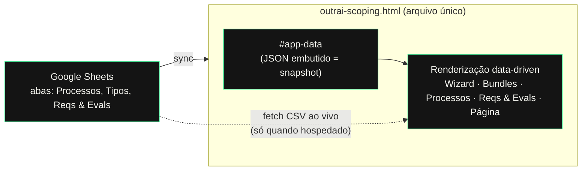

# outrai · Manual da V1

*Aplicação de escopo e processos de projeto. Documento de referência da versão 1.*

- **Aplicação:** arquivo único HTML. Para deploy, use `index.html` (mesmo conteúdo; é o nome que o host serve na raiz da URL).
- **Fonte da verdade dos dados:** [planilha no Google Sheets](https://docs.google.com/spreadsheets/d/19_scUsjHcdQx5CJw0SwTz3rUB45w6kuiT5gzhfaQOqM/edit)
- **Modelo combinado:** fonte única = Sheets; o **app** apenas **lê** a planilha e nunca escreve de volta (as escritas na planilha, quando o assistente ajuda, são feitas fora do app — ver *Governança e acessos*).
- **Editores da planilha:** apenas Felipe e Alice.

---

# Parte 1 — Guia para editores e testadores

Leitura para quem vai **preencher a planilha** e **testar a aplicação**. Não é preciso saber programar.

## O que é a aplicação

Uma ferramenta para tipificar um projeto, ver os processos envolvidos, suas estimativas de esforço e o detalhamento (requisitos, ações e critérios de pronto) de cada processo. O conteúdo de detalhamento vem da planilha; o resto é a lógica da metodologia.

## As abas

| Aba | Para que serve |
|---|---|
| **Wizard** | Responde-se um funil de perguntas e ele classifica o projeto em um dos 25 tipos, recomenda os processos, estima esforço e monta um roadmap. É o ponto de entrada para escopar um projeto novo. |
| **Bundles** | Catálogo de referência dos 25 tipos de projeto (famílias A–E), cada um com um conjunto inicial de processos recomendados. Consulta, não depende da planilha. |
| **Processos** | Biblioteca de todos os processos, por etapa, com descrição e os tempos de esforço (💪 humano / 🦾 IA), em horas e somente leitura. O nome do processo vira **link** quando ele tem detalhamento preenchido; sem conteúdo, aparece em verde fraco (sem link). |
| **Reqs & Evals** | Navegação do detalhamento por etapa → processo → átomo. Cada átomo mostra Requisitos, Ações e Evals. Somente leitura — reflete a planilha. |
| **Página do processo** | Não é uma aba: abre ao clicar no nome de um processo (com conteúdo) na aba Processos. Mostra, numa página só, a descrição + todos os átomos com seus Requisitos/Ações/Evals. Tem **Voltar** e navegação **anterior/próximo** entre os processos que têm conteúdo. |

## Como preencher a planilha para aparecer no app

O detalhamento vive na aba **Reqs & Evals** da planilha. **Uma linha = um átomo** (uma tarefa dentro de um processo).

| Coluna | O que colocar |
|---|---|
| **Etapa** | O nome da fase (ex.: `Descoberta`, `Design da Estrutura`). |
| **Processo** | O nome do processo **exatamente** como aparece no app (ex.: `User Research`, `Wireframes`, `Documento de Visão`). |
| **Átomo (tarefa)** | O título da tarefa. |
| **Tag** | `humano` ou `ia`. |
| **Requisitos** | Um ou mais itens, separados por ` | ` (espaço-barra-espaço). |
| **Ações** | Idem, separados por ` | `. |
| **Evals** | Idem, separados por ` | `. |

### Regras de ouro

1. **O nome do Processo precisa bater exatamente** com o do app. Se estiver diferente (acento, maiúscula, espaço), a linha é **ignorada** silenciosamente. O jeito seguro é copiar o nome da aba Processos. (Nomes ignorados aparecem no console do navegador, para facilitar a correção.)
2. **Separe múltiplos itens com ` | `** — cada item vira um marcador na lista.
3. **Tag só aceita** `humano` ou `ia` (qualquer outra coisa cai em `humano`).
4. **Um processo só fica clicável** na aba Processos (e ganha página de detalhe) **quando tem pelo menos uma linha** na aba Reqs & Evals.
5. Descrição e tempos (💪/🦾) ficam na aba **Processos** da planilha, não na Reqs & Evals.
6. **As colunas são reconhecidas pelo nome do cabeçalho, não pela posição.** Você pode reordenar as colunas ou inserir colunas auxiliares (notas, links) sem quebrar o app. O que não deve mudar sem avisar são os *nomes* dos cabeçalhos Processo / Átomo / Tag / Requisitos / Ações / Evals.

## Como ver o que você preencheu

- **Na versão publicada (produção):** o app lê a planilha ao carregar. Salve na planilha e **recarregue a página** do app.
- **No preview aqui do chat:** o preview não busca a planilha ao vivo (restrição de segurança do ambiente). Para atualizar, peça no chat **"sincroniza o R&E"** — o assistente relê a planilha e regenera o app.

## Como testar (checklist rápido)

1. Abra a URL de produção.
2. Percorra as abas Wizard, Bundles, Processos, Reqs & Evals.
3. Na aba Processos, confira que só os processos com conteúdo estão clicáveis.
4. Clique num processo com conteúdo → confira descrição, átomos, Requisitos/Ações/Evals.
5. Use **anterior/próximo** e **Voltar**.
6. Edite uma linha na planilha, recarregue o app, confirme que apareceu.

---

# Parte 2 — Arquitetura e contexto

Referência técnica para não depender da memória do chat. Descreve como a V1 está montada e por quê.

## Visão em uma frase

**O Google Sheets é a fonte da verdade; a aplicação é um arquivo HTML único que lê os dados da planilha e apenas os exibe (read-only).**

## Fluxo de dados

Há **dois caminhos** para o dado da planilha chegar na tela:

1. **Snapshot embutido (`#app-data`)** — sempre presente. É um bloco `<script type="application/json">` dentro do HTML, parseado no carregamento. Faz o app funcionar offline, no preview e como fallback.
2. **Leitura ao vivo (`syncAtomsFromSheet`)** — ao carregar, o app tenta buscar o CSV da aba *Reqs & Evals* e substituir os átomos. Se falhar (CSP do preview, offline ou CORS), mantém o snapshot embutido. Ativa de fato **quando o app está hospedado** e a planilha está acessível.

## Componentes internos

| Peça | Papel |
|---|---|
| `#app-data` (JSON) | Snapshot dos dados. Chaves: `phases`, `detail`, `atoms`, `families`, `types`. |
| `DATA` | Objeto em memória, resultado do parse do `#app-data`. |
| `syncAtomsFromSheet()` | Busca a aba Reqs & Evals como CSV, converte em `DATA.atoms`, re-renderiza. Fallback ao embutido. |
| `render*()` | Funções que desenham cada aba a partir de `DATA` — tudo data-driven, nada hardcoded por processo. |
| `window.storage` | Uso **opcional** (edições de estimativa e textos dos bundles). Não é essencial; o app funciona sem. |

## Esquema dos dados

- `DATA.phases`: `[{ id, name, procs: [[procId, label], ...] }]` — estrutura canônica das etapas e processos (41 processos).
- `DATA.detail[procId]`: `{ description, estimate:{ humanHours, aiHours }, internalReviewHours, requirements[], evals[], activities[] }` — descrição e tempos.
- `DATA.atoms[procId]`: `[{ titulo, tag:'humano'|'ia', req[], acoes[], evals[] }]` — o detalhamento editado na planilha.
- `DATA.families` / `DATA.types`: as 5 famílias (A–E) e os 25 tipos.

## Mapeamento planilha → app (aba Reqs & Evals)

O parser é **guiado pelo cabeçalho**: cada coluna é localizada pelo *nome* na primeira linha (normalizado — sem acento, minúsculas, por trecho-chave), não pela posição. Reordenar colunas ou inserir colunas auxiliares **não quebra** a leitura.

| Coluna (reconhecida por) | Vira |
|---|---|
| "Processo" | `procId` (correspondência exata do rótulo → id) |
| "Átomo"/"tarefa" | `titulo` |
| "Tag" | `tag` (`ia` se for "ia", senão `humano`) |
| "Requisitos" / "Ações" / "Evals" | arrays, quebrando cada célula em ` | ` |

Comportamentos de borda, todos com *fallback* seguro ao snapshot embutido:

- **Rótulo de Processo não reconhecido** → linha descartada, com aviso no console listando o nome. É a fragilidade a vigiar; por isso a regra de "nome exato".
- **Cabeçalho sem coluna "Processo"** (ex.: renomearam a coluna) → leitura ao vivo abortada, mantém o embutido, avisa no console os cabeçalhos que viu.
- **CSV vazio/ilegível, offline ou CORS** → mantém o embutido.

## Restrição técnica que molda tudo

No preview de artefato (aqui no chat), o sandbox **bloqueia busca de dados externos (CSP)**. Por isso o app não lê a planilha ao vivo neste ambiente e depende do snapshot embutido. A leitura ao vivo só funciona **num host próprio**.

## Governança e acessos

Três planos de acesso **independentes**:

| Plano | Quem | Como se controla |
|---|---|---|
| **Editar os dados** (Reqs & Evals, estimativas, tipos/bundles, etapas, processos, átomos) | Felipe e Alice | Planilha **Restrita**; os dois como **Editores** |
| **Evoluir/publicar o app** | Felipe | Conta do host só dele; só ele faz deploy |
| **Usar o app** (Wizard etc.) | Aberto | Deploy público, sem trava de acesso |

**Como as escritas na planilha acontecem** (o app nunca escreve; quem escreve são as pessoas, e o assistente às vezes ajuda dentro da sessão do Chrome de Felipe — não de forma autônoma):

| Tipo de mudança | Quem/como | Frequência |
|---|---|---|
| **Estrutura** (coluna/aba nova, renome de cabeçalho) | Assistente executa na sessão de Felipe, confirmando cada gravação; e ajusta o app no mesmo passo | rara |
| **Conteúdo em volume** (popular processos inteiros) | Assistente gera bloco pronto (TSV/CSV no formato da aba), Felipe/Alice colam | futuro |
| **Conteúdo pontual** | Felipe/Alice, copy-paste | recorrente |

**Protocolo de mudança estrutural:** como o mesmo assistente evolui o app e mexe na estrutura da planilha, os dois lados mudam juntos. Graças ao parser guiado por cabeçalho, inserir/reordenar colunas não exige mudança no app; só **renomear um cabeçalho** reconhecido pede ajuste coordenado (planilha + app no mesmo passo).

## Publicação (pôr no ar)

Como o **app é aberto** (qualquer um com a URL usa o Wizard), a escolha de host fica livre; não é preciso repositório privado. Opções *forever-free* para um arquivo estático:

| Host | Free | Precisa repo público? | Restringe acesso de graça? |
|---|---|---|---|
| **Netlify** (Starter) | Sim | Não (upload direto do arquivo) | Não |
| **Cloudflare Pages** | Sim | Não | **Sim** — Cloudflare Access (login por e-mail, ~50 usuários) |
| **GitHub Pages** | Só repo **público** | Sim | Não |

> Nota: GitHub Pages grátis só serve repositório **público** — foi o que barrou o uso inicial. Com o app aberto, repo público deixa de ser problema, mas Netlify (upload direto) evita expor o código num repo.

**Recomendação:** se URL pública basta, **Netlify** (arrastar o `index.html`, conta grátis para fixar a URL) — simples e alinhado a "centralizar em Felipe". Se um dia quiser travar o acesso sem custo, **Cloudflare Pages + Access**.

**Para a leitura ao vivo funcionar** mantendo o documento privado: **Publicar na web apenas a aba "Reqs & Evals" como CSV** (Arquivo → Compartilhar → Publicar na web). Isso expõe só os valores daquela aba (o resto do documento segue restrito) e dá uma URL `…/pub?...output=csv` estável e buscável de qualquer host. Passe essa URL ao assistente; ela vira a constante `SHEET_CSV_URL` no app.

**Decisões/execuções que são de Felipe (o assistente não faz):** criar/entrar na conta do host e publicar; definir editores e publicar-na-web a aba. Envolvem credenciais e permissões da conta Google.

**Alerta de privacidade:** a URL do CSV publicado é pública para quem a tiver (embora só exponha a aba Reqs & Evals). A página do app também é pública por URL, salvo se usar Cloudflare Access.

**Pendências para fechar a V1:** (1) host escolhido; (2) URL de publicação da aba Reqs & Evals. Com as duas, o assistente troca a `SHEET_CSV_URL` e valida o primeiro deploy.

**Verificação pós-deploy:** abra a URL publicada; se o detalhamento aparecer e a barra da aba Reqs & Evals disser "sincronizado ao vivo", a leitura ativa está funcionando. Se não, revise o publicar-na-web/compartilhamento — o app segue exibindo o último snapshot embutido nesse meio-tempo.

## Escopo e limitações conhecidas da V1

- **Leitura ao vivo cobre a aba Reqs & Evals (átomos).** Descrições e tempos vêm do snapshot embutido; como mudam pouco, são atualizados por um re-sync sob demanda (peça "sincroniza"). Live para todas as abas é candidato a V1.1.
- **O conteúdo atual de Reqs & Evals são exemplos** autorados para calibração (4 processos: User Research, Teste de Usabilidade, Wireframes, Documento de Visão), não definições canônicas.
- **O app é read-only:** ele nunca escreve na planilha. Edições de conteúdo e de estrutura acontecem na planilha — ver *Governança e acessos*.
- **Estado em `window.storage`** (estimativas/blurbs) pode não sobreviver a republicações; não é a casa do dado.

## Como sai uma nova versão

1. Ajustes de código/lógica são feitos aqui no chat sobre o arquivo atual.
2. Se mudou dado da planilha: rodar o sync (relê a planilha → regenera `#app-data`).
3. Baixar o `index.html` resultante e **redeployar** no host.
