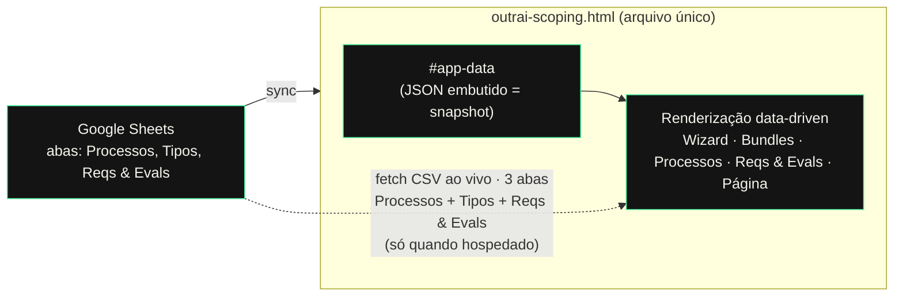

# outrai scoping · manual da V1

*Aplicação de escopo e processos de projeto. Documento de referência da versão 1.*

- **Aplicação:** arquivo único HTML. Para deploy, use `index.html` (mesmo conteúdo; é o nome que o host serve na raiz da URL).
- **Fonte da verdade dos dados:** [planilha no Google Sheets](https://docs.google.com/spreadsheets/d/19_scUsjHcdQx5CJw0SwTz3rUB45w6kuiT5gzhfaQOqM/edit)
- **Modelo combinado:** fonte única = Sheets; o **app** apenas **lê** a planilha e nunca escreve de volta (as escritas na planilha, quando o assistente ajuda, são feitas fora do app — ver *Governança e acessos*).
- **Editores da planilha:** apenas Felipe e Alice.
- **Snapshot date:** o campo `snapshotDate` no bloco `#app-data` registra a data em que o snapshot embutido foi gerado. É exibido no selo de sincronia (canto inferior direito) quando o app está usando o snapshot.

---

# Parte 1 — Guia para editores e testadores

Leitura para quem vai **preencher a planilha** e **testar a aplicação**. Não é preciso saber programar.

## O que é a aplicação

Uma ferramenta para tipificar um projeto, ver os processos envolvidos, suas estimativas de esforço e o detalhamento (requisitos, ações e critérios de pronto) de cada processo. O conteúdo de detalhamento vem da planilha; o resto é a lógica da metodologia.

## As abas

| Aba | Para que serve |
|---|---|
| **Wizard** | Responde-se um funil de perguntas e ele classifica o projeto em um dos 25 tipos, recomenda os processos, estima esforço e monta um roadmap. É o ponto de entrada para escopar um projeto novo. |
| **Bundles** | Catálogo de referência dos 25 tipos de projeto (famílias A–E), cada um com um conjunto inicial de processos recomendados. Nome e família de cada tipo vêm da aba **Tipos** (ao vivo); os atributos que definem a recomendação ficam no código. |
| **Processos** | Biblioteca de todos os 41 processos, por etapa, com descrição e os tempos de esforço (💪 humano / 🦾 IA), em horas e somente leitura. **Todos** os processos são clicáveis: os que têm detalhamento (átomos) aparecem em **verde vivo**; os que ainda não têm aparecem em **verde pálido**. Ambos abrem a Página do processo. |
| **Reqs & Evals** | Navegação do detalhamento por etapa → processo → átomo. Cada átomo mostra Requisitos, Ações e Evals. Somente leitura — reflete a planilha. |
| **Página do processo** | Não é uma aba: abre ao clicar no nome de qualquer processo na aba Processos. Mostra, numa página só, a descrição + todos os átomos com seus Requisitos/Ações/Evals (ou aviso de "sem conteúdo" se o processo ainda não tem átomos). Tem **Voltar**, um contador de posição (`N / 41`) e navegação **anterior/próximo** que percorre **todos os 41 processos** na ordem canônica (não apenas os que têm conteúdo). Os botões de anterior/próximo usam opacidade reduzida para processos sem conteúdo. |

## Como preencher a planilha para aparecer no app

O detalhamento vive na aba **Reqs & Evals** da planilha. Cada linha = um **átomo** (uma tarefa dentro de um processo).

| Coluna | O que preencher | Exemplo |
|---|---|---|
| Etapa | Etapa do processo (informativo) | Descoberta |
| Processo | Nome **exato** como aparece no app | User Research |
| Átomo (tarefa) | Título curto do átomo | Recrutamento |
| Tag | `humano` ou `ia` | `humano` |
| Requisitos | O que é preciso antes de começar; separe com ` \| ` | Persona aprovada \| Roteiro pronto |
| Ações | O trabalho em si; separe com ` \| ` | Recrutar 5 participantes \| Agendar sessões |
| Evals | Como saber que ficou pronto; separe com ` \| ` | 5 entrevistas realizadas \| Transcrições entregues |

## Como ver o que você preencheu

- **Na versão publicada (produção):** o app lê a planilha ao carregar. Vale para as 3 abas de conteúdo — **Processos** (estrutura, descrição, tempos), **Tipos** (nome, família) e **Reqs & Evals** (átomos). Salve na planilha e **recarregue a página** do app.
- **Mudanças estruturais** (criar/remover/reordenar processos, renomear `id` ou nome de processo, nova etapa) refletem ao recarregar. Porém, se o **Wizard** referencia o processo afetado, o selo de sincronia avisa que o código precisa ser atualizado pelo assistente.
- **No preview aqui do chat:** o preview não busca a planilha ao vivo (restrição de segurança do ambiente). Para atualizar, peça no chat **"sincroniza"** — o assistente relê a planilha e regenera o app.

### Regras de ouro

1. **O nome do Processo precisa bater exatamente** com o do app. Se estiver diferente (acento, maiúscula, espaço), a linha é **ignorada** silenciosamente. O jeito seguro é copiar o nome da aba Processos. (Nomes ignorados aparecem no console do navegador, para facilitar a correção.)
2. **Separe múltiplos itens com ` | `** — cada item vira um marcador na lista.
3. **Tag só aceita** `humano` ou `ia` (qualquer outra coisa cai em `humano`).
4. **Um processo aparece em verde vivo** na aba Processos **quando tem pelo menos uma linha** na aba Reqs & Evals. Processos sem conteúdo aparecem em verde pálido — ambos são clicáveis e abrem a Página do processo.
5. Descrição e tempos (💪/🦾) ficam na aba **Processos** da planilha, não na Reqs & Evals.
6. **As colunas são reconhecidas pelo nome do cabeçalho, não pela posição.** Pode reordenar ou inserir colunas auxiliares sem quebrar o app. Não mude os *nomes* dos cabeçalhos: Processos — `id` / Etapa / Processo / Descrição / Humano / IA / Revisão; Reqs & Evals — Processo / Átomo / Tag / Requisitos / Ações / Evals; Tipos — Código / Família / Nome do tipo.
7. **A coluna `id` (Processos) é uma chave técnica, não o nome que se lê** (isso é a coluna Processo). Não edite o `id` casualmente: amarra o processo às etapas, ao detalhe e aos átomos, e é referenciado pela lógica do Wizard. Renomear um `id` é **mudança estrutural** — avise o assistente para propagar no código do Wizard também.
8. **Se você renomear um Processo (coluna nome), atualize o mesmo nome na aba Reqs & Evals.** O vínculo dos átomos é pelo nome do processo; renomeou num lado e não no outro, os átomos daquele processo deixam de aparecer (o console avisa quais nomes não bateram).
9. **Adicionar um processo novo** reflete na biblioteca/Bundles ao recarregar, mas o **Wizard só passa a recomendá-lo depois de o assistente sincronizar o código** (o selo vermelho sinaliza). **Adicionar um tipo novo** na aba Tipos precisa dos atributos que hoje só existem no código → é mudança estrutural (avise o assistente).

## Governança e acessos

O app é **read-only**; toda escrita acontece na planilha. O assistente (Claude) pode ler a planilha para gerar snapshots e ajudar em revisões, mas **nunca** escreve na planilha por conta própria — edições explícitas de Felipe ou Alice.

Mudanças no app (lógica do Wizard, CSS, nova funcionalidade) passam pelo assistente no chat e resultam em um novo `index.html`.

Fluxo de nova versão: (1) pedir a mudança no chat → (2) assistente modifica e testa → (3) baixar o `index.html` resultante e **redeployar** no host.

### Checklist de teste

1. Abra a aplicação (preview ou produção).
2. Na aba Wizard, percorra o funil até gerar uma recomendação.
3. Na aba Processos, confira que processos com conteúdo estão em verde vivo e sem conteúdo em verde pálido. Ambos devem ser clicáveis.
4. Clique num processo com conteúdo → confira descrição, átomos, Requisitos/Ações/Evals.
5. Clique num processo sem conteúdo → confira descrição e aviso de "sem conteúdo".
6. Use **anterior/próximo** (deve percorrer todos os 41) e **Voltar**.
7. Confira o contador de posição (`N / 41`) na navegação.
8. Edite uma linha na planilha, recarregue o app, confirme que apareceu.

---

# Parte 2 — Arquitetura e contexto

Referência técnica para não depender da memória do chat. Descreve como a V1 está montada e por quê.

## Visão em uma frase

**O Google Sheets é a fonte da verdade; a aplicação é um arquivo HTML único que lê os dados da planilha e apenas os exibe (read-only).**

## Fluxo de dados

Há **dois caminhos** para o dado da planilha chegar na tela:

1. **Snapshot embutido (`#app-data`)** — sempre presente. Bloco `<script type="application/json">` dentro do HTML, parseado no carregamento. Faz o app funcionar offline, no preview e como fallback. Inclui o campo `snapshotDate` (ISO date) que registra quando o snapshot foi gerado.
2. **Leitura ao vivo (`syncAll()`)** — ao carregar, o app busca as **3 abas** por CSV, na ordem: `syncProcessosFromSheet()` (reconstrói `phases` + `detail`), `syncTiposFromSheet()` (nome/família dos tipos) e `syncAtomsFromSheet()` (`atoms`). Ao final, `runSyncDiagnostics()` cruza o que o Wizard usa com o que existe na planilha e atualiza o selo.

## Componentes internos

| Peça | Papel |
|---|---|
| `#app-data` (JSON) | Snapshot dos dados. Chaves: `snapshotDate`, `phases`, `detail`, `atoms`, `families`, `types`. |
| `DATA` | Objeto em memória, resultado do parse do `#app-data`. |
| `syncProcessosFromSheet()` | Busca a aba Processos como CSV; reconstrói `phases` e atualiza descrição e tempos (Humano/IA/Revisão) dos processos (chave = `id`), recomputa estimativas e re-renderiza. Fallback ao embutido. |
| `syncTiposFromSheet()` | Busca a aba Tipos como CSV; atualiza nome e família dos 25 tipos existentes (chave = Código). Fallback ao embutido. |
| `syncAtomsFromSheet()` | Busca a aba Reqs & Evals como CSV, converte em `DATA.atoms`, re-renderiza. Fallback ao embutido. |
| `syncAll()` | Orquestrador: roda os 3 syncs na ordem certa (Processos → Tipos → Átomos) e depois `runSyncDiagnostics()`. |
| `runSyncDiagnostics()` | Cruza os ids usados pelo Wizard com os que existem na planilha; atualiza o selo. |
| `procsWithContent()` | Lista processos que têm pelo menos 1 átomo. Usada para filtros e exports. |
| `allProcs()` | Lista todos os 41 processos na ordem canônica (por fase), incluindo flag `hasContent`. Usada pela navegação prev/next da Página do processo. |
| `renderProcesses()` | Desenha a aba Processos com todos os nomes como links — classe `.bright` (verde vivo, tem átomos) ou `.dim` (verde pálido, sem átomos) — mais tempos somente-leitura. |
| `renderProcPage(id)` | Renderiza a página de detalhe de um processo (descrição + átomos read-only), com navegação prev/next entre **todos os 41** processos. Mostra indicador de posição (`N / 41`). Processos sem conteúdo mostram aviso amigável. Botões prev/next para processos sem conteúdo são exibidos com opacidade reduzida. |
| `render*()` | Demais funções que desenham cada aba a partir de `DATA` — tudo data-driven, nada hardcoded por processo. |
| `window.storage` | Uso **opcional** (edições de estimativa e textos dos bundles). Não é essencial; o app funciona sem. |

## Esquema dos dados

- `DATA.snapshotDate`: `"2026-07-09"` — ISO date do último snapshot embutido.
- `DATA.phases`: `[{ id, name, procs: [[procId, label], ...] }]` — estrutura canônica das etapas e processos (41 processos).
- `DATA.detail[procId]`: `{ description, estimate:{ humanHours, aiHours }, internalReviewHours, requirements[], evals[], activities[] }` — descrição e tempos.
- `DATA.atoms[procId]`: `[{ titulo, tag:'humano'|'ia', req[], acoes[], evals[] }]` — o detalhamento editado na planilha.
- `DATA.families` / `DATA.types`: as 5 famílias (A–E) e os 25 tipos.

## Mapeamento planilha → app (aba Reqs & Evals)

O parser é **guiado pelo cabeçalho**: cada coluna é localizada pelo *nome* na primeira linha (normalizado — sem acento, minúsculas, por trecho-chave), não pela posição. Reordenar colunas ou inserir colunas auxiliares **não quebra** a leitura.

| Coluna (reconhecida por) | Vira |
|---|---|
| "Processo" | `procId` (correspondência exata do rótulo → id) |
| "Átomo"/"tarefa" | `titulo` |
| "Tag" | `tag` (`ia` se for "ia", senão `humano`) |
| "Requisitos" / "Ações" / "Evals" | arrays, quebrando cada célula em ` | ` |

Comportamentos de borda, todos com *fallback* seguro ao snapshot embutido:

- **Rótulo de Processo não reconhecido** → linha descartada, com aviso no console listando o nome. É a fragilidade a vigiar; por isso a regra de "nome exato".
- **Cabeçalho sem coluna "Processo"** (ex.: renomearam a coluna) → leitura ao vivo abortada, mantém o embutido, avisa no console os cabeçalhos que viu.
- **CSV vazio/ilegível, offline ou CORS** → mantém o embutido.

## Mapeamento planilha → app (aba Processos)

Também guiado por cabeçalho; a **chave é o `id`** (coluna). Reconstrói a estrutura inteira (etapas, ordem, ids, nomes) e o detalhe (descrição, tempos).

| Coluna (reconhecida por) | Vira |
|---|---|
| "id" | chave do processo em `DATA.detail` |
| "Etapa" | agrupamento em fase |
| "Processo" | rótulo legível (coluna nome) |
| "Descrição" | `detail[id].description` (célula vazia **não** apaga a atual) |
| "Humano (h)" / "IA (h)" | `detail[id].estimate.humanHours` / `.aiHours` |
| "Revisão interna (h)" | `detail[id].internalReviewHours` |

- **Sem coluna "id"** → leitura ao vivo da aba abortada, mantém o embutido.

## Mapeamento planilha → app (aba Tipos)

Guiado por cabeçalho; chave = **Código** (ex.: A1, B2, E6).

| Coluna | Vira |
|---|---|
| "Código" | chave do tipo |
| "Família" | família (A–E) |
| "Nome do tipo" | nome exibido no catálogo e Wizard |

Atributos de comportamento de cada tipo (output, preexist, dev, scope, hasRV, salto) continuam no código; a aba Tipos atualiza apenas nome e família.

## Snapshot date

O campo `snapshotDate` (string ISO, e.g. `"2026-07-09"`) no bloco `#app-data` é atualizado pelo assistente toda vez que gera um novo snapshot. O selo de sincronia (`sync-badge`) inclui a data quando exibindo o snapshot embutido, para que se saiba qual versão dos dados está visível. Ao vivo, o selo menciona a data base apenas no tooltip.

## Selo de sincronia

Badge fixo no canto inferior direito. Três estados:

| Cor | Texto | Significado |
|---|---|---|
| Verde | `planilha ao vivo` | As 3 abas foram lidas da planilha com sucesso. |
| Âmbar | `snapshot · YYYY-MM-DD` ou `parcial · N/3 ao vivo` | Uma ou mais abas não puderam ser lidas; exibindo snapshot embutido (total ou parcial). |
| Vermelho | `sincronia: divergência` | O Wizard referencia ids de processo que não existem na planilha. O código precisa ser sincronizado pelo assistente. |

## Restrição técnica (CSP do preview)

No preview do chat (ambiente Claude), o navegador bloqueia o `fetch` para o Sheets — comportamento esperado, não é um bug. O app cai no snapshot embutido. Para testar a leitura ao vivo, é preciso hospedar o arquivo.

## Limitações conhecidas da V1

- **A leitura ao vivo cobre as 3 abas:** Processos (estrutura + descrição + tempos), Tipos (nome/família) e Reqs & Evals (átomos). Adicionar/remover/reordenar/renomear processos e criar etapas refletem ao recarregar.
- **O que fica no código (a exceção a vigiar):** a **engine de recomendação do Wizard** — as regras condicionais que decidem, por tipo, quais processos são recomendados. Referenciam ids de processo. Se um id for criado/removido/renomeado na planilha, o Wizard só acompanha depois de o assistente sincronizar o código; o **selo de sincronia** avisa (vermelho) quando há essa divergência.
- **Tipos ao vivo só nome/família.** Os atributos de comportamento de cada tipo (que alimentam o Wizard) ainda vivem no código, pois a aba Tipos não tem essas colunas. Expandir a aba é candidato a V1.1.
- **O conteúdo atual de Reqs & Evals são exemplos** autorados para calibração (4 processos), não definições canônicas.
- **O app é read-only:** nunca escreve na planilha. Ver *Governança e acessos*.
- **Estado em `window.storage`** (estimativas/blurbs) pode não sobreviver a republicações; não é a casa do dado.

## Publicação e deploy

**Para a leitura ao vivo funcionar** mantendo o documento privado: **Publicar na web as 3 abas como CSV** — **"Processos"**, **"Tipos"** e **"Reqs & Evals"** (Arquivo → Compartilhar → Publicar na web, uma aba por vez, formato CSV). Isso expõe só os valores dessas abas (o resto do documento segue restrito) e dá URLs `…/pub?...output=csv` estáveis, buscáveis de qualquer host. Passe as três URLs ao assistente; elas viram as constantes `PROC_CSV_URL` (Processos), `TIPOS_CSV_URL` (Tipos) e `SHEET_CSV_URL` (Reqs & Evals) no app.

**Decisões/execuções que são de Felipe (o assistente não faz):** criar/entrar na conta do host e publicar; definir editores e publicar-na-web as abas. Envolvem credenciais e permissões da conta Google.

**Alerta de privacidade:** as URLs dos CSVs publicados são públicas para quem as tiver (embora só exponham essas três abas). A página do app também é pública por URL, salvo se usar Cloudflare Access.

**Pendências para fechar a V1:** (1) host escolhido; (2) URLs de publicação das 3 abas. Com elas, o assistente troca as três constantes e valida o primeiro deploy.

**Verificação pós-deploy:** abra a URL publicada e olhe o **selo de sincronia** no canto: verde "planilha ao vivo" confirma que as 3 abas foram lidas. Se ficar âmbar/parcial, uma aba não foi publicada; se ficar vermelho, há divergência entre Wizard e planilha (o console diz qual). No meio-tempo o app exibe o último snapshot embutido.

---

## Changelog

### 2026-07-09 — Páginas de processo para todos os 41 + snapshot date

- Todos os 41 processos são navegáveis: a Página do processo abre para qualquer um, mesmo sem átomos preenchidos.
- Navegação anterior/próximo percorre todos os 41 na ordem canônica.
- Na aba Processos, processos com conteúdo aparecem em verde vivo (`.bright`); sem conteúdo em verde pálido (`.dim`). Ambos clicáveis.
- Contador de posição (`N / 41`) na navegação da Página do processo.
- `snapshotDate` adicionado ao `#app-data`, exibido no selo de sincronia.
- Funções adicionadas: `allProcs()`.

### 2026-07-08 — Leitura ao vivo das 3 abas + diagnóstico

- `syncProcessosFromSheet()` reconstrói estrutura inteira (etapas, ordem, ids, nomes, descrição, tempos).
- `syncTiposFromSheet()` atualiza nome e família dos 25 tipos.
- `syncAll()` orquestra na ordem Processos → Tipos → Átomos.
- `runSyncDiagnostics()` + selo de sincronia (verde/âmbar/vermelho).
- Parser guiado por cabeçalho (não mais por posição de coluna).
- Renomeação `geradoras` → `generativas` propagada no Wizard.

### 2026-07-07 — V1 base

- Wizard, Bundles, Processos, Reqs & Evals.
- Leitura ao vivo da aba Reqs & Evals com fallback ao snapshot.
- Página de detalhe de processo (read-only, prev/next entre processos com conteúdo).
- Manual-v1 criado.
